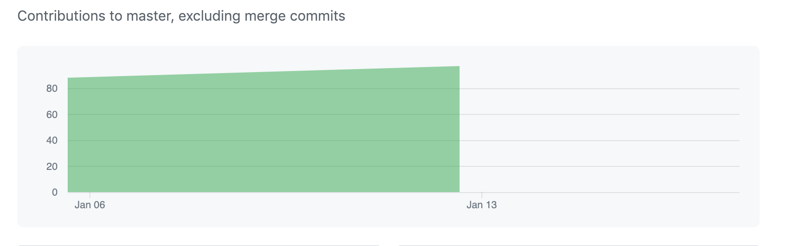
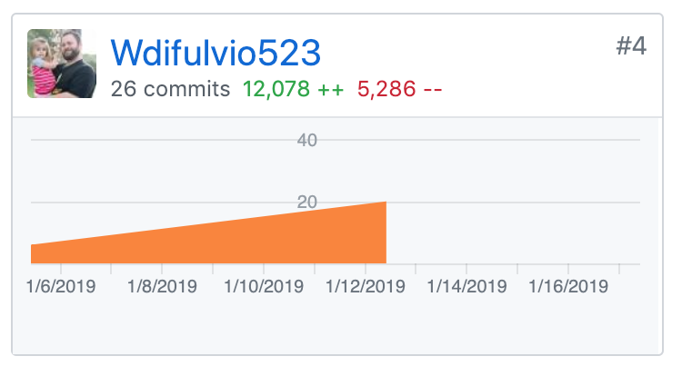

### Week 2 - Now We're Rolling!

Week two was a blast! All the planning we did in week one was truly a benefit to avoid some of the pitfalls that could have happened this week. Let's get into it:

Part 1 - Individual Accomplishments this Week

My biggest individual accomplishment this week was the completing some of the Calendar functionality. We are not using a npm package for the Calendar, instead opting for a custom calendar component so we would have complete control over customization and functionality. Let me tell you, it is a behemoth! I go into more details below as to what I completed so far on the Calendar, and I still have a ways to go on it!


Team Contribution graph: 

https://github.com/Lambda-School-Labs/labs9-workout-tracker/graphs/contributors

GitHub Handle: Wdifulvio523




### Tasks Pulled

Ticket 1

Front-End: Calendar functionality. Explained in detail below.

https://github.com/Lambda-School-Labs/labs9-workout-tracker/pull/42

Trello: https://trello.com/c/Ue8j1HOu 


Ticket 2

Backend: Completed endpoint for creating a new workout as well as for GET scheduled workouts

https://github.com/Lambda-School-Labs/labs9-workout-tracker/pull/25

Trello: https://trello.com/c/nHeLWsWT 


Ticket 3

Workout/Schedule Workout Endpoints

https://github.com/Lambda-School-Labs/labs9-workout-tracker/pull/32

Trello: https://trello.com/c/nHeLWsWT

Ticket 4

Split README up into Root readme (overall project info), front-end readme and back-end readme.
Added Endpoints to back-end README.md including responses to each request.
added routes to front-end readme

https://github.com/Lambda-School-Labs/labs9-workout-tracker/pull/35

Trello: https://trello.com/c/ec4LS07z

#### Detailed Analysis:

I'd like to go into detail about my Calendar functionality, as it is easily the most difficult code to read and understand. The two features that I completed functionality for were to render a scheduled workout on it's particular date, and   to render a specific component based on whether date has a workout already scheduled. These two features are closely related, and here's how I went about it.

To render a scheduled workout on it's particular date, I created a span and then mapped over scheduleWorkouts array, checking if the date matched a variable I create. If it did, the title of the workout would render.

```
    <span>
      {//maps through scheduleworkouts
      this.props.scheduleWorkouts.map(sworkout => {
        // returns the title of the scheduled workout if it matches matchedDate
       const splitDate = sworkout.date.split("T")[0]
        return splitDate === matchedDate
         ? sworkout.title
          : null;
      })}
    </span>
```

To render a specific component based on whether a date has a workout assigned, I created a function to check if an array contains a tring and return true/false

```
    const arrayContains = (str, array) => {
      let populated = false;
      array.forEach(stringObj => {
        if (stringObj.date.split("T")[0] === str) {
          populated = true;
        }
      });
      return populated;
    };
```

Then, I used that function inside of an onClick property, also utilizing a ternary operator, sending in `true` or `false` to my `onDateClick` function:
```
  onClick={
      //Check whether the matchedDate is inside of scheduled workouts
      // using arrayContains method
         arrayContains(matchedDate, this.props.scheduleWorkouts) ===
      true
        ? //if so, runs onDateClick with true
          () => {
            this.onDateClick(dateFns.parse(cloneDay), true);
         }
        : //else runs onDateClick with false
          () => {
           this.onDateClick(dateFns.parse(cloneDay), false);
          }
       }
```

My onDateClick function then takes the day and the flag, and sets the state based on the incoming parameters:

```
 onDateClick = (day, isPopulated) => {
    if (this.state.selectedDate === null) {
      this.setState({
        selectedDate: day,
        datePopulated: isPopulated,
        dateSelected: true
      });
    } else {
      this.setState({
        selectedDate: null,
        datePopulated: false,
        dateSelected: false
      });
    }
  };
```

Finally, I rendered one of two components based on the outcome of the `OnDateClick` method:

```
  // if date is selected, check if date is populated and return component
        this.state.datePopulated === true ? (
          <div>
            <WorkoutDetails dispatch={this.props.dispatch} scheduleWorkouts={this.props.scheduleWorkouts} />
          </div>
        ) : (
          <div>
            <AddWorkout
              workouts={this.props.user.workouts}
              scheduleWorkouts={this.props.user.scheduleWorkouts}
            />
          </div>
        )
```


I also commented my code heavily in this area of the calendar, as withouth the comments it could be hard to read. Here is the entirety of the `renderCells` function (A good 100 lines of code!):

```
renderCells() {
    const { currentMonth, selectedDate } = this.state;
    const monthStart = dateFns.startOfMonth(currentMonth);
    const monthEnd = dateFns.endOfMonth(monthStart);
    const startDate = dateFns.startOfWeek(monthStart);
    const endDate = dateFns.endOfWeek(monthEnd);

    const dateFormat = "D";
    const dateMatch = "YYYY-MM-DD";
    const rows = [];

    let days = [];
    let day = startDate;
    let formattedDate = "";
    let matchedDate = "";

    const arrayContains = (str, array) => {
      let populated = false;
      array.forEach(stringObj => {
        if (stringObj.date.split("T")[0] === str) {
          populated = true;
        }
      });
      return populated;
    };

    while (day <= endDate) {
      //Loop through days 1-7
      for (let i = 0; i < 7; i++) {
        //formattedDate to render onto the cell
        formattedDate = dateFns.format(day, dateFormat);
        //matched date to check against scheduled workout date
        matchedDate = dateFns.format(day, dateMatch);
        //create a clone of the day to update selected date when cell is clicked
        const cloneDay = day;

        //pushing into the days array
        days.push(
          <>
            {/* checking if scheduleWorkouts is defined */}
            {this.props.scheduleWorkouts === undefined ? 
            
            // IF no scheduled workouts, right now the cells don't render. Need to decide what to do here.
            null : (
              <div
                className={`col cell ${
                  !dateFns.isSameMonth(day, monthStart)
                    ? "disabled"
                    : dateFns.isSameDay(day, selectedDate)
                    ? "selected"
                    : ""
                }`}
                key={day}
                onClick={
                  //Check whether the matchedDate is inside of scheduled workouts
                  // using arrayContains method
                  arrayContains(matchedDate, this.props.scheduleWorkouts) ===
                  true
                    ? //if so, runs onDateClick with true
                      () => {
                        this.onDateClick(dateFns.parse(cloneDay), true);
                      }
                    : //else runs onDateClick with false
                      () => {
                        this.onDateClick(dateFns.parse(cloneDay), false);
                      }
                }
              >
                <span className="number">{formattedDate}</span>
                <span className="bg">{formattedDate}</span>
                <span>
                  {//maps through scheduleworkouts
                  this.props.scheduleWorkouts.map(sworkout => {
                    // returns the title of the scheduled workout if it matches matchedDate
                    const splitDate = sworkout.date.split("T")[0]
                    return splitDate === matchedDate
                      ? sworkout.title
                      : null;
                  })}
                </span>
              </div>
            )}
          </>
        );
        day = dateFns.addDays(day, 1);
      }
      rows.push(
        <div className="row" key={day}>
          {days}
        </div>
      );
      days = [];
    }
    return <div className="body">{rows}</div>;
  }
```


#### Milestone Reflections


Overall, it was a very productive week all around! We hit our Milestones as a team, and got a `3` on our MVP goals for the week. The planning in week one definitely prevented some issues that we would have undoubtedly experiences without planning. Integrating the APIs and servers all into one project went about as smoothly as I could have predicted, because the entire team was on the same page about all aspects of the project. We only had one API, Stripe -  it was implemented on Monday and fully functional on tuesday. I'm truly happy that I joined this project with this group, because we've been really making progress towards our Project MVP.


Whiteboard (success!): https://youtu.be/vwFosfgL5QY


Live Deployed Front-End: https://fitmetrix.netlify.com/

Live Deployed Back-End: https://fitmetrix.herokuapp.com/api/user


