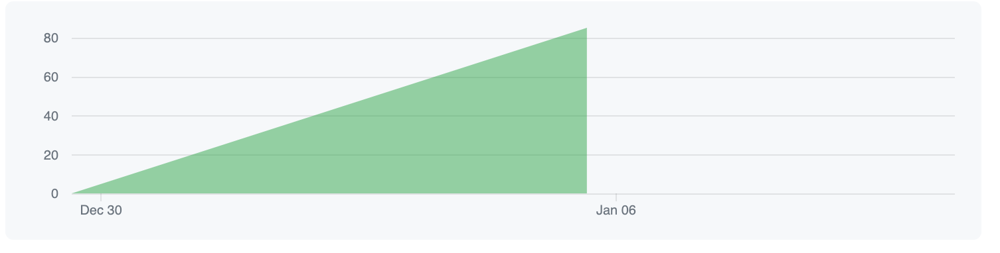
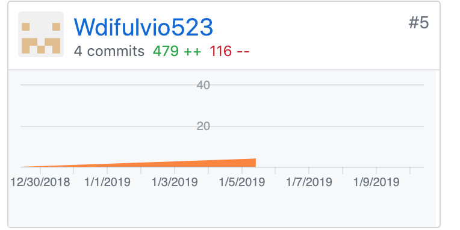

Part 1 - Individual Accomplishments this Week

On day 1, our team completed the Technical Design Document (TDD) to make sure we had a solid understanding of our project. We made decisions as a team as to what technologies we would use for the front and back-end, as well as for the database. In addition, I found a way to create a custom calendar component to avoid having to install an additional dependency.

Day 2 was the first day of the project initialization. The team split up into Front-end and back-end groups. On front-end, we built out the folder structure, created all the necessary component files and folders, and standardized our naming conventions. We aldo downloaded needed dependencies like react-router, and deployed the application to Netlify.

On day 3, the team figured out how the data will be presented to the front-end, and how to manage state. We also decided what part of the data is needed on each component. This was one of the most important things we did, before actually getting into the coding. I was trying to prevent "spaghetti code," and also trying to prevent having to create the data on the back-end as we're coding the front end. Finally, we refactored all major components to be styled components. 

Day 4 was my back-end day, as I was on Front-end the rest of the week. We completed endpoints for the Category database, including GET all catrgories, GET category by userID, and POST category. We also completed GET by user ID on workouts database. We used async/await for endpoints (rather than promises, which I was used to), so I had to familiarize myself with that syntax, but now looking back it seems more intuitive than promises.


Team Contribution graph: 

https://github.com/Lambda-School-Labs/labs9-workout-tracker/graphs/contributors

GitHub Handle: Wdifulvio523

Contributions did not seem to be showing up for me over the first three days. The computer I use for the project is my Lambda Loaner computer, so when I made commits, they were showing up under "Lambda_School_Loaner_46". I have since made corrections, and beginning from Day 4 my commits should now be populating correctly under my GitHub Handle.



Tasks Pulled

Ticket 1

Trello: https://trello.com/c/PwBEritM

Back-End: https://github.com/Lambda-School-Labs/labs9-workout-tracker/pull/18 - Created Delete for metrics, created PUT for users and created GETALL and GETBYID for workouts.


Ticket 2

Trello: 
https://trello.com/c/ec4LS07z
https://trello.com/c/vZ4ZmOYd

Front-End: https://github.com/Lambda-School-Labs/labs9-workout-tracker/pull/19 - Solo PR. Added data structure to README.md. Continued working on Schedule view page. Commented areas that will need further discussion/clarification


Ticket 3

Trello: https://trello.com/c/Ue8j1HOu

https://github.com/Lambda-School-Labs/labs9-workout-tracker/pull/15 -Passed needed props to schedule view and its child components. refactored needed components to function components to remove state. adjusted size and shape of calendar to allow for additional edits. Added data structure to README.md. Continued working on Schedule view page. Commented areas that will need further discussion/clarification.


Ticket 4

Trello: https://trello.com/c/vZ4ZmOYd

https://github.com/Lambda-School-Labs/labs9-workout-tracker/pull/9 -styled components. Also added the styled components dependency. Finally, we populated the SideNav components with links to the other views

#### Detailed Analysis:

https://github.com/Lambda-School-Labs/labs9-workout-tracker/pull/19

This was my Solo Pull request. For this PR, I continued working on Schedule view page, as I will probably be owning that page for the most part. In addition, I commented on some areas that I believed would need further discussion/clarification: 
- An instance in one of our view that we could create an additional compnent to make the code more straightforward. 

```
const WorkoutDetails = (props) => {
  return <WorkoutDetailsStyle>WorkoutDetails</WorkoutDetailsStyle>;	  

      /*Mapping through schedule workouts to return the category, 
    then I needed to map through exercises as well to render each exercise from the exercise array.
    Another choice is to create another component after mapping through schedule workouts, 
    and mapping through the exercises array on that component -wd */

     {props.scheduleWorkouts.map(scheduleWorkout => {
    return (
      <div key={scheduleWorkout.id}>

         <p>{scheduleWorkout.category.name}</p>
        {scheduleWorkout.exercises.map(exercise => {
          return (
            <p key={exercise.id}>{exercise.name}</p>
          )
        })}
      </div>
    )
  })}</WorkoutDetailsStyle>;
  ```

- An instance on schedule view that I believe may neet to be a Class component rather than a function component as it currently was.


``` 
I believe this view needs it's own state so that we can render the Addworkout/Workout details
components based on a dateSelected flag, as well as based on whether the date selected is already populated

class ScheduleView extends React.Component {
  constructor(props) {
    super(props);
    this.state = {
      dateSelected: false
    };
  }

  selectDate() {
    console.log(this)
    console.log(this.state)
    // this.setState({dateSelected:true})
  }
```

Finally, I added our data structure to README.md for clarification purposes.


#### Milestone Reflections

 What did you do to help the team solidify as a group? What did you do that you now realize caused friction in this process?

 This week, I believe I did a number of things to help solidify the team as a group. I have a lot of experience working on a team, and especially as a team leader, that I am comfortable facilitating discussion and communicating effectively. During day 1 when we were working on the Technical design document, I made sure the entire team was on the same page as far as technologies, as well as on the database model. On Day 3, as we began work on the functionality, I brought the team together to have a complete discussion of our Data structure so that Front-end and Back-end were on the same page as to how the information would be presented. I think both of these cases are examples of how I brought the team together. However, there was one thing I did that, looking back, I feel I could have approached differently: When we were discussing state management, the group was initially deciding to use redux (which I am not as comfortable with as I am with React). I, however, disagreed, and pushed to use React for state management, which is what we eventually decided on using. Looking back, I feel that I should have put aside my own reservations and did what was best for the Team and project.


Technical Design Document Link: https://docs.google.com/document/d/1bf85YKXkPxtMmbC5fXgqM1soF9CiTSDIDejN49aTBXA/edit?usp=sharing

Live Deployed Front-End: https://fitmetrix.netlify.com/

Live Deployed Back-End: https://fitmetrix.herokuapp.com/api/user/info/22

User Models can be seen on the back-end server

