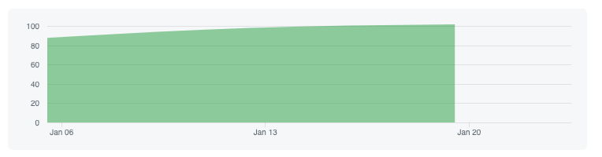
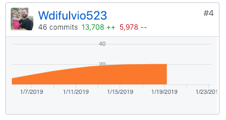

### Week 3 - Feature Complete!

This week was another fantastic one! we started out the week bedhind due to being off for the holiday on Monday, but on Tuesday we hit the ground running to make sure we hit 100% feature complete by check-in on Thursday. 

### Part 1 - Individual Accomplishments this Week

I had numerous personal accomplishments this week! I knocked out a few features, including Scheduling a workout, checking off exercises as completed, Unscheduling a previously-scheduled workout, making scheduled workout reoccurring for a number of weeks that the user dictates, and finally, refactoring the Calendar to use hooks! I also added a previously-missed endpoint on our back-end server, which was to delete (or "Unschedule") a scheduled workout. In addition to that functionality, myself and another member of my group went through each page and made every route 100% responsive. Overall, I feel like it was a very productive week!


Team Contribution graph: 


https://github.com/Lambda-School-Labs/labs9-workout-tracker/graphs/contributors

GitHub Handle: Wdifulvio523 - The entire week one of not getting my contributions entered has made this number look lower than it is, but that issue has since been fixed and weeks 2 and 3 have had proper contribution metrics.




### Tasks Pulled

#### Ticket 1

Front-End: Schedule Workouts Functionality - Explained in detail below.

https://github.com/Lambda-School-Labs/labs9-workout-tracker/pull/73

Trello: https://trello.com/c/0WPdrPOC

#### Ticket 2

Back-End: Completed endpoint for deleting a scheduled workout to allow for front-end functionality.

https://github.com/Lambda-School-Labs/labs9-workout-tracker/pull/72

Trello: https://trello.com/c/nHeLWsWT

#### Ticket 3

Added Responsive design to Landing page, sign-in/register, settings, progress routes.

https://github.com/Lambda-School-Labs/labs9-workout-tracker/pull/69

Trello: https://trello.com/c/NuPeSlwt

#### Ticket 4

Bugfix: Fixed a bug add workout feature that didn't allow recurring workouts when less than seven days were left in the month.

https://github.com/Lambda-School-Labs/labs9-workout-tracker/pull/74

Trello: https://trello.com/c/xMhAckhF

#### Detailed Analysis:

This week I'm going to explain, in detail, how I completed functionality for "Unscheduling" a scheduled workout, as well as functionality to allow for recurring scheduled workouts.

Fisrt, the functionality for unscheduling a scheduled workout. We're using hooks in our Application to allow for state management and to avoid the need for multiple class components. The hook I used for this allowed me to manipulate the scheduled workouts on the component, and is as follows:
 ```
 const { state, dispatch } = useContext(Store);
 const [sWorkouts, setSWorkouts] = useState(state.scheduleWorkouts);
```

I created a function that I would add to the scheduled workout's "Unschedule" buttons' onClick handler. Here is the function:

```
const unscheduleWorkout = async (e, scheduleWorkout) => {
   console.log(scheduleWorkout)
   const token = await firebase.auth().currentUser.getIdToken();

   const deleteRes = await axios.delete(
    `https://fitmetrix.herokuapp.com/api/schedule/delete/workout/${scheduleWorkout.id}`,
    {
        headers: {
          Authorization: token
        }
    }
  );

  console.log('deleteRes:', deleteRes)

    if (deleteRes.status === 200) {
      console.log("200 OK")
      const newScheduleWorkouts = await axios.get('https://fitmetrix.herokuapp.com/api/schedule',
      {
          headers: {
            Authorization: token
          }
      })

      dispatch({type: "UPDATE_SCHEDULE_WORKOUTS", payload: newScheduleWorkouts.data})
      setSWorkouts();
  }
 }
 ```

 In the function, it is bringing in the scheduled workout. After it generates a token, it makes a delete call to the backend server to delete the scheduled workout. If the status of the response is `200` (meaning that the delete went through), then it maked another call to get the updated scheduled workouts, which allows for the re-render of the component.

The onClick handler is as follows:
```
  <button 
  type="button" 
  onClick={(e) => unscheduleWorkout(e, scheduleWorkout)}
  >
  Unschedule</button>
  ```

Next, allowing for recurring scheduled workouts. Again, I used a hook to manipulate the value of my recurring flag, as well as the value of the number of recurring weeks:
```
 const [recurring, setRecurring] = useState(false);
 const [recurringWeeks, setRecurringWeeks] = useState(null);
 ```
I then added a checkbox to change that recurring to true when checked, as well as an input so the user can put how many weeks they want the workout to be recurring:
```
<input 
    type='checkbox' 
    checked={recurring} 
    onChange={e=> setRecurring(e.target.checked)}
    />
 <input
    type="number"
    value={recurringWeeks}
    onChange={e => setRecurringWeeks(e.target.value)}
    />
```
I then added the scheduled workout, the selected date, and recurringWeeks arguments onto my Schedule button
```
 <button
    onClick={e => {
        scheduleWorkoutHandler(
        e,
        workout,
        props.selectedDate,
        recurringWeeks
        );
    }}
>
```
The handler to schedule a workout is as follows, with the recurring bit towards the end:

```
const scheduleWorkoutHandler = async (e, workout, date, recurringWeeks) => {
    e.preventDefault();
    const token = window.localStorage.getItem("login_token");

    // add to scheduled workout array
    const workoutObj = {
      date,
      workout_id: workout.id
    };

    console.log("schedworkouthandler workoutObj:", workoutObj);

    const scheduleWorkout = await axios
      .post("https://fitmetrix.herokuapp.com/api/schedule/create", workoutObj, {
        headers: {
          "Content-Type": "application/json",
          Authorization: token
        }
      })
      .catch(err => console.log(err));
    if (recurring === true) {
      //Adds 7 days to the incoming date
      const addSevenDays = (date, seven) => {
        let result = new Date(date);
        result.setDate(result.getDate() + seven);
        return result;
      };

      for (let i = 1; i <= recurringWeeks -1 ; i++) {
        const nextWeek = addSevenDays(date, 7);
        let nextWeekObj = new Date(nextWeek);
        console.log(nextWeekObj);
        const recurringWorkoutObj = {
          date: nextWeekObj,
          workout_id: workout.id
        };
        
        date = nextWeek;

              const scheduleRecurringWorkout = await axios.post("https://fitmetrix.herokuapp.com/api/schedule/create", recurringWorkoutObj, {
                headers: {
                  'Content-Type': 'application/json',
            Authorization: token
          }
        })
        .catch(err => console.log(err))
      }
    }
  };
```
I created an `if` statement checking if recurring was true. If it is true, I created a helper function to add seven days to the date, then created a loop that goes until the number of recurringWeeks, and creates a new scheduled workout /POST request on each iteration. I'm very happy with the outcome!


#### Milestone Reflections

Q: Describe your experiences working with a team to convert a disparate set of components into a single, cohesive, and complete product. Describe the challenges you faced and the steps you took to overcome them.

I cannot say enough good things about this team! We had a lot of functionality to get through to hit 100% feature complete, and every single person on the team rose to the challenge in their own way. Even with the short week, we were at 80% feature complete on Tuesday, but not one of us were happy with that - we knew that we wanted to be 100% feature complete. The communication between the team, and reaching out for assistance from team member when we get stuck somewhere or have a question about someone else's code, is the best out of any team I've ever been on. I struggle to think of a single challenge brought on by miscommunication. 

One feature in particular was something that the whole team decided to change. Originally, there was a feature to copy a whole week's worth of exercises and paste it for the next week. We changed that feature to be where a user can make singular workouts recurring for however many weeks in a row. We thought this change to the feature would make the application more intuitive for people wanting to workout. Once the change got approved, we implemented the recurring feature and now users can make their workouts recurring!


### Whiteboard
My whiteboard this week was Balanced Binary Tree. Here is the problem:

Given a binary tree class that looks like this:

```class BinaryTreeNode {
  constructor(value) {
    this.value = value;
    this.left = null;
    this.right = null;
  }

  insertLeft(value) {
    this.left = new BinaryTreeNode(value);
    return this.left;
  }

  insertRight(value) {
    this.right = new BinaryTreeNode(value);
    return this.right;
  }
}
```
Write a function that checks to see if a given binary tree is perfectly balanced, meaning all leaf nodes are located at the same depth. Your function should return true if the tree is perfectly balanced and false otherwise.

Analyze the time and space complexity of your function.

At first, I was completely stumped by this problem. I knew that I needed to compare the two leaf nodes, but I couldn't figure out how to do so. I decided to use recursion and compare the max depths of thw two leaf nodes, then compare the minimum depths of the two leaf nodes, using helper functions. I then compared the results of those two solutions by finding the difference. IF the difference was equal to `0`, that meant they were at the dame depth, would return true, 

Overall, I would have liked to find a non-recursive solution to this whiteboard, as the time complexity increases in recursion.


Whiteboard: https://youtu.be/foThq-Bi004

Live Deployed Front-End: https://fitmetrix.netlify.com/

Live Deployed Back-End: https://fitmetrix.herokuapp.com/api/user


