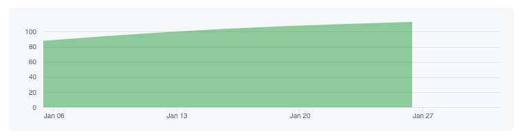
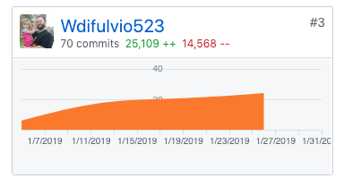

### Week 4 - UX and UI and Polish, oh my!

Week four has come and gone, and we're still chugging along! This week we focused primarily on UX and UI. The team attended three meetings with UI professionals to help us make our user experience top-notch, and we re-vamped our design almost from the bottom-up this week!

### Part 1 - Individual Accomplishments this Week

Personally, I felt I had a challenging week. I worked mainly on the Calendar page, which includes the workout details and Addworkout components. While the team overall was incredibly productive, and the Calendar page came out looking great, I felt that I struggled a good amount this week. I pride myself on being a problem-solver, and this week, for some reason, I was having trouble overcoming certain programming challenges I faced this week alone, which would prompt me to ask for help from my teammates. While teammates helping teammates is a good thing, I felt like I was taking away their productivity to help with my lack thereof. I reason that it's possible I experienced my first spat of programmers block, or possibly burnout due to 12-hour days of programming for the past few weeks. Nevertheless, I plan on regrouping over this coming weekend and hitting week 5 in stride.


Team Contribution graph: 


https://github.com/Lambda-School-Labs/labs9-workout-tracker/graphs/contributors

Self Contribution Graph




### Tasks Pulled

#### Ticket 1

Implemented styling and functional bugfixes for addworkout component. Explained in detail below

https://github.com/Lambda-School-Labs/labs9-workout-tracker/pull/99/files

Trello: https://trello.com/c/hBsDNNNO/62-design-calendar-views

#### Ticket 2

Implemented side drawer form for workout Details

https://github.com/Lambda-School-Labs/labs9-workout-tracker/pull/95


Trello: https://trello.com/c/hBsDNNNO/62-design-calendar-views

#### Ticket 3

Changed App Header and title to be more professional. Created media breakpoints for calendar pages to allow for mobile viewing for users.

https://github.com/Lambda-School-Labs/labs9-workout-tracker/pull/100

Trello: https://trello.com/c/hBsDNNNO/62-design-calendar-views

#### Ticket 4

Setting page tabs and settings form validation

https://github.com/Lambda-School-Labs/labs9-workout-tracker/pull/88

Trello: https://trello.com/c/QE0kS9gD

#### Detailed Analysis:

I'd like to speak about how we created the addworkout Drawer component, as well as a few other components, using a reusable form modal component throughout our site to add a layer of consistency for our users. This involved a good amount of refactoring code that was already present in the AddWorkout component.

First I wrapped the AddWorkout component inside our FormModal reuseable component, and passed certain props to the Form Modal:
```
<FormModal
      onSubmit={{ scheduleWorkoutHandler }}
      closeModal={() => dispatch({ type: "UPDATE_DATE_SELECTED" })}
      title={"Add Workout"}
    >
```

The first two props that are passed are two functions to run when the form is either submitted or closed. The first function, `scheduleWorkoutHandler`, handles the call to the database when the user wants to add a workout to their calendar. This function also allows for scheduling recurring workouts based on input from the user:
```
const scheduleWorkoutHandler = async (e, workout, date, recurringWeeks) => {
    e.preventDefault();
    const token = window.localStorage.getItem("login_token");
    const workoutObj = {
      date,
      workout_id: workout.id
    };
    const scheduleWorkout = await axios
      .post("https://fitmetrix.herokuapp.com/api/schedule/create", workoutObj, {
        headers: {
          "Content-Type": "application/json",
          Authorization: token
        }
      })
      .catch(err => console.log(err));
    if (recurring === true) {
      //Adds 7 days to the incoming date
      const addSevenDays = (date, seven) => {
        let result = new Date(date);
        result.setDate(result.getDate() + seven);
        return result;
      };
      for (let i = 1; i <= recurringWeeks - 1; i++) {
        const nextWeek = addSevenDays(date, 7);
        let nextWeekObj = new Date(nextWeek);
        console.log(nextWeekObj);
        const recurringWorkoutObj = {
          date: nextWeekObj,
          workout_id: workout.id
        };
        date = nextWeek;
        const scheduleRecurringWorkout = await axios
          .post(
            "https://fitmetrix.herokuapp.com/api/schedule/create",
            recurringWorkoutObj,
            {
              headers: {
                "Content-Type": "application/json",
                Authorization: token
              }
            }
          )
          .catch(err => console.log(err));
      }
    }
    if (scheduleWorkout.status === 201) {
      console.log("I AM HERE");
      const newSW = await axios.get(
        "https://fitmetrix.herokuapp.com/api/schedule",
        {
          headers: {
            Authorization: token
          }
        }
      );
      dispatch({
        type: "UPDATE_SCHEDULE_WORKOUTS",
        payload: newSW.data
      });
    }
  };
```

The second function, which runs on close of the form (but not necessarily on submit), is a dispatch which pulls the state using hooks and context. The portion of state that it pulls, specifically, is to update whether the date was selected. This allows for the AddWorkout modal component to close and reset the state back to where it was before the modal opened.


#### Milestone Reflections

Q: Describe experiences working with a team to make your product look and feel as good as it works under the hood

This was another great week with the team, even though my personal contributions this week were challenging. At the beginning of the week, we were all a little nervous at the amount of design and UX we had to complete. After speaking with UX/UI professionals on Tuesday, we decided to revamp our entire design structure. This turned out to be an incredibly effective change and, by the end of the week, we had an almost completely polished product. It was a bit of a shock shifting the duties and focus of the entire team to focus on front-end design. There was a lot of discussion, as design is notoriously subjective, and the team landed on the same page for most of the ideas. Overall, I couldn't be happier with the group that I'm working with.


### Whiteboard
My whiteboard this week was Binary Search Tree from Sorted Array. Here is the problem:

```
Given an array that is sorted in ascending order containing unique integer elements, write a function that receives the sorted array as input and creates a valid binary search tree with minimal height.

For example, given an array [1, 2, 3, 4, 5, 6, 7], your function should return a binary search tree with the form 4 / 
2 6 / \ / 
1 3 5 7

Note that when we say "binary search tree" in this case, we're just talking about a tree that exhibits the expected form of a binary search tree. The tree in this case won't have an insert method that does the work of receiving a value and then inserting it in a valid spot in the binary search tree. Your function should place the values in valid spots that adhere to the rules of binary search trees, while also seeking to minimize the overall height of the tree.

Here's a BinaryTreeNode class that you can use to construct a binary search tree:

class BinaryTreeNode {
  constructor(value) {
    this.value = value;
    this.left = null;
    this.right = null;
  }
}
Analyze the time and space complexity of your solution.
```

I honestly was stumped from the start at this question, as I have not yet gone through Computer Science. I decided that, even though I was pretty certain I wouldn't finish in the time-limit, I was going to at least get started. I began by making sure that I understood what the problem wanted. I focused on the input (array) and the output (binary search tree). considering it was a binary search tree, with the middle valu at the top of the tree, I knew I needed to find the middle value of the array and split the array into the left and right based on the middle.  I found the mid index by using a helper function and the Math global object. I quickly realized I would need recursion, which I'm admittedly not great at. While I'm disappointed I did not complete the problem, I'm happy with the progress I made towards the solution.

Whiteboard: https://youtu.be/dgy5HXfNpws

Live Deployed Front-End: https://fitmetrix.netlify.com/

Live Deployed Back-End: https://fitmetrix.herokuapp.com/api/user

