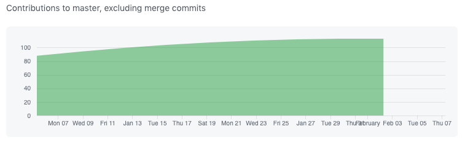
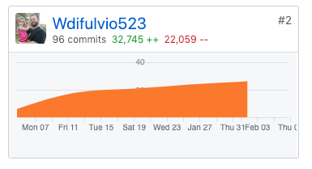

### Week 5 - Final Touches!

This week we had a plan put in place to fix our remaining bugs, complete two rounds of user testing, and implement that feedback before the end of the week, and we did js tthat! we now have a polished, well-put-together application that is ready for use!

### Part 1 - Individual Accomplishments this Week

This week went a lot smoother for me, individually, than last week did. There was no imposter syndrome or programmers block that I experienced last week, and I was incredibly productive. I contributed to completing the calendar refactor to use hooks and store, completed styling for the entire schedule view page, and much more! 


Team Contribution graph: 


https://github.com/Lambda-School-Labs/labs9-workout-tracker/graphs/contributors

Self Contribution Graph




### Tasks Pulled

#### Ticket 1

Calendar Refactor to use hooks and Store. Explained in detail below.

https://github.com/Lambda-School-Labs/labs9-workout-tracker/pull/111

Trello: https://trello.com/c/9kZUpvpc

#### Ticket 2

Mobile styling for scheduleWorkout and workout details

https://github.com/Lambda-School-Labs/labs9-workout-tracker/pull/121

Trello: https://trello.com/c/h4kJrwIG

#### Ticket 3

Bugfixes for ScheduleWorkout and Calendar

https://github.com/Lambda-School-Labs/labs9-workout-tracker/pull/123

Trello: https://trello.com/c/h4kJrwIG

#### Ticket 4

Brand Renaming from fitmetrix to Flexlog

https://github.com/Lambda-School-Labs/labs9-workout-tracker/pull/154

Trello: https://trello.com/c/2FtoBqFV

#### Detailed Analysis:

I'm going to go into detail about how we refactored the Calendar component to not only use hooks, but to use context and the store as well, to avoid the need for the component to have it's own state or be a Class component. 
First, we imported the needed data from state, which we get from the store, and removed those hooks from the component. So this: 
```
  const [selectedDate, setselectedDate] = useState(null);	
  const [datePopulated, setdatePopulated] = useState(false);
```

Became this: 
```
const { state, dispatch } = useContext(Store);
const { currentDay, datePopulated, dateSelected } = state;
```

Then, everywhere in the code where we were using props, or where we had a hook on the component itself (rather than on index), we replace that with the data coming from state. So, things like this:
```
 <div	
                className={`col cell ${	
                  !dateFns.isSameMonth(day, monthStart)	
                    ? "disabled"	
                    : dateFns.isSameDay(day, selectedDate)	
                    ? "selected"	
                    : ""	
                }`}	
                key={`${day}${Math.random()}`}	
                onClick={() => onDateClick(dateFns.parse(cloneDay), false)}	
              >
```

Became this, where the hook is changed to what is on state:
```
 <div
                className={`col cell ${
                  !dateFns.isSameMonth(day, monthStart)
                    ? "disabled"
                    : dateFns.isSameDay(day, currentDay)
                    ? "selected"
                    : ""
                }`}
                key={`${day}${Math.random()}`}
                onClick={() => onDateClick(dateFns.parse(cloneDay), false)}
              >
```

We then had to change the functionality to match our new rafactor, so we used dispatch to retrieve all the updates from state so that they can render. 
The old way: 
```
  const onDateClick = (day, isPopulated) => {	
    // selecteddate null, dates length =0	
    if (selectedDate === null) {	
      setselectedDate(day);	
      setdatePopulated(isPopulated);	
      dispatch({ type: "UPDATE_DATE_SELECTED" });	
    } else {	
      setselectedDate(null);	
      setdatePopulated(isPopulated);	
      dispatch({ type: "UPDATE_DATE_SELECTED" });	
    }	
  };
```
The new way:
```
  const onDateClick = (day, isPopulated) => {
      dispatch({ type: "UPDATE_CURRENT_DAY", payload: day })
      dispatch({ type: "UPDATE_DATE_SELECTED" });
      dispatch({ type: "UPDATE_IS_POPULATED", payload: isPopulated })
  };
```

Honestly, the more I work with and learn about hooks, the more excited I am to continue to use them!

#### Milestone Reflections

Q: Describe the experiences working with a team to bring an application to completion. The 90-90 rule is a quip referencing the very real difficulty of truly completing a project. Describe some of the final tasks that were the most difficult for your team to resolve - challenging bugs, layout and presentation woes, or anything else that was easy to get mostly working, but hard to get perfect


I didn't believe the 90-90 rule until we actually got to the final 10% of polish, but boy is it real! We completed two rounds of user testing and implemented feedback, and it seemed like every time we fixed something, we found something else that needed fixing! I though the bugs would be the most difficult thing to fix, but they were relatively simple. The most challenging part was perfecting the design in all wiewports, including mobile. But it was a fantastic experience overall and I am happy to be in this group of programmers as I believe we made an awesome project!


Live Deployed Front-End: https://flexlog.netlify.com/

Live Deployed Back-End: https://fitmetrix.herokuapp.com/api/user

